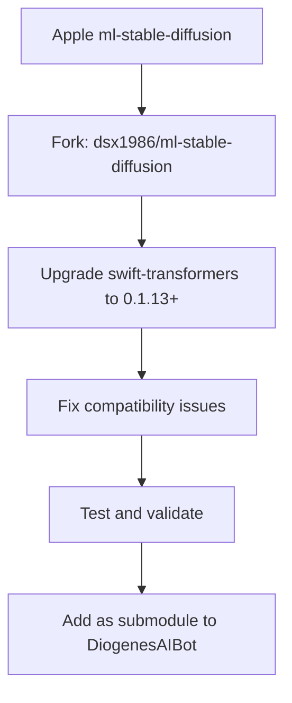

# ML Stable Diffusion Upgrade Design Document

## Overview

This document outlines the design and implementation plan for upgrading Apple's ml-stable-diffusion to support swift-transformers 0.1.13+ and integrating it as a submodule in DiogenesAIBot.

## Problem Statement

### Current Dependency Conflict

DiogenesAIBot currently faces a dependency conflict:

- **FastVLM Requirements**: swift-transformers 0.1.13+ (via mlx-swift-examples)
- **ml-stable-diffusion**: swift-transformers 0.1.8 (exact version)
- **WhisperKit**: swift-transformers 0.1.8 (upToNextMinor)

### Impact

- Cannot use both FastVLM and image generation simultaneously
- Build fails when all dependencies are included
- Forced to choose between video understanding and image generation features

## Solution Architecture

### 1. Fork and Upgrade Strategy



### 2. Repository Structure

```
diogenesaibotswift/
├── DiogenesAIBot/
├── docs/
├── ml-stable-diffusion/          # Submodule
│   ├── swift/
│   │   ├── StableDiffusion/
│   │   └── StableDiffusionCLI/
│   ├── Package.swift             # Updated dependencies
│   └── README.md
├── FastVLM_Production_Checklist.md
└── README.md
```

## Implementation Plan

### Phase 1: Fork and Initial Setup

#### 1.1 Create Fork
- [ ] Fork `apple/ml-stable-diffusion` to `dsx1986/ml-stable-diffusion`
- [ ] Clone fork locally for development
- [ ] Create feature branch: `feature/swift-transformers-0.1.13-upgrade`

#### 1.2 Analyze Current Dependencies
```swift
// Current Package.swift
dependencies: [
    .package(url: "https://github.com/huggingface/swift-transformers.git", exact: "0.1.8"),
]
```

#### 1.3 Identify Breaking Changes
- [ ] Review swift-transformers changelog from 0.1.8 to 0.1.13+
- [ ] Identify API changes and deprecations
- [ ] Document required code modifications

### Phase 2: Dependency Upgrade

#### 2.1 Update Package.swift
```swift
// Target Package.swift
dependencies: [
    .package(url: "https://github.com/huggingface/swift-transformers.git", from: "0.1.13"),
]
```

#### 2.2 Compatibility Matrix
| Component | swift-transformers 0.1.8 | swift-transformers 0.1.13+ | Status |
|-----------|---------------------------|----------------------------|---------|
| BPETokenizer | ✅ Working | 🔄 Needs Testing | Pending |
| Transformers API | ✅ Working | 🔄 Needs Testing | Pending |
| Model Loading | ✅ Working | 🔄 Needs Testing | Pending |
| Text Encoding | ✅ Working | 🔄 Needs Testing | Pending |

### Phase 3: Code Migration

#### 3.1 Critical Files to Update
```
swift/StableDiffusion/
├── pipeline/
│   ├── StableDiffusionPipeline.swift     # Core pipeline
│   └── StableDiffusionXLPipeline.swift   # XL variant
├── models/
│   ├── TextEncoder.swift                 # Text encoding
│   └── Tokenizer.swift                   # Tokenization
└── schedulers/
    └── Scheduler.swift                    # Diffusion scheduling
```

#### 3.2 Expected API Changes
Based on swift-transformers evolution:

```swift
// Old API (0.1.8)
let tokenizer = BPETokenizer(mergesAt: mergesURL, vocabularyAt: vocabURL)

// New API (0.1.13+) - Expected changes
let tokenizer = try BPETokenizer(mergesAt: mergesURL, vocabularyAt: vocabURL)
// or
let tokenizer = BPETokenizer.load(merges: mergesURL, vocabulary: vocabURL)
```

### Phase 4: Testing and Validation

#### 4.1 Compatibility Testing
- [ ] Unit tests for tokenization
- [ ] Integration tests for text encoding
- [ ] End-to-end image generation tests
- [ ] Performance benchmarking

#### 4.2 Test Matrix
| Platform | Model | Resolution | Status |
|----------|-------|------------|---------|
| macOS | SD 1.5 | 512x512 | 🔄 Pending |
| macOS | SDXL | 1024x1024 | 🔄 Pending |
| iOS | SD 1.5 | 512x512 | 🔄 Pending |
| iOS | SDXL | 768x768 | 🔄 Pending |

#### 4.3 Validation Criteria
- [ ] Generated images match quality of original implementation
- [ ] Performance within 5% of original
- [ ] Memory usage comparable
- [ ] No crashes or stability issues

### Phase 5: Integration as Submodule

#### 5.1 Add Submodule
```bash
cd diogenesaibotswift
git submodule add https://github.com/dsx1986/ml-stable-diffusion.git ml-stable-diffusion
git submodule update --init --recursive
```

#### 5.2 Update DiogenesAIBot Project
- [ ] Remove existing ml-stable-diffusion package dependency
- [ ] Add local package reference to submodule
- [ ] Update build settings and paths

#### 5.3 Xcode Configuration
```swift
// In Package.swift or project settings
.package(path: "./ml-stable-diffusion")
```

## Risk Assessment

### High Risk
- **API Breaking Changes**: swift-transformers 0.1.13+ may have incompatible APIs
- **Performance Regression**: Newer version might be slower
- **Model Compatibility**: Existing Core ML models might not work

### Medium Risk
- **Build Complexity**: Submodule management adds complexity
- **Maintenance Overhead**: Need to maintain fork separately
- **Testing Coverage**: Ensuring all features work across platforms

### Low Risk
- **Documentation**: Need to update integration docs
- **CI/CD**: May need to update build scripts

## Mitigation Strategies

### For API Breaking Changes
1. **Gradual Migration**: Update one component at a time
2. **Compatibility Layer**: Create wrapper functions for changed APIs
3. **Fallback Implementation**: Keep working version as backup

### For Performance Issues
1. **Benchmarking**: Establish baseline performance metrics
2. **Profiling**: Identify performance bottlenecks
3. **Optimization**: Target specific slow areas

### For Model Compatibility
1. **Version Testing**: Test with multiple model versions
2. **Conversion Scripts**: Update model conversion if needed
3. **Validation Pipeline**: Automated testing for model compatibility

## Timeline

### Week 1: Setup and Analysis
- [ ] Fork repository
- [ ] Analyze breaking changes
- [ ] Create development environment

### Week 2: Implementation
- [ ] Update dependencies
- [ ] Fix compilation errors
- [ ] Basic functionality testing

### Week 3: Testing and Validation
- [ ] Comprehensive testing
- [ ] Performance validation
- [ ] Bug fixes

### Week 4: Integration
- [ ] Add as submodule
- [ ] Update DiogenesAIBot
- [ ] Final testing and documentation

## Success Criteria

1. **Functional**: All image generation features work with swift-transformers 0.1.13+
2. **Compatible**: Both FastVLM and image generation work simultaneously
3. **Performance**: No significant performance degradation
4. **Stable**: No crashes or memory issues
5. **Maintainable**: Clear upgrade path for future versions

## Rollback Plan

If the upgrade fails:
1. **Immediate**: Revert to commenting out conflicting dependencies
2. **Short-term**: Use separate apps for different features
3. **Long-term**: Investigate alternative image generation libraries

## Future Considerations

### Upstream Contribution
- Consider contributing fixes back to Apple's repository
- Maintain compatibility with upstream changes
- Document differences for future merges

### Alternative Solutions
- Monitor for official Apple updates
- Evaluate other Swift-based diffusion implementations
- Consider Core ML-only approach without swift-transformers

## Conclusion

This upgrade strategy provides a path to resolve the dependency conflict while maintaining all functionality. The submodule approach allows for independent maintenance while keeping the main project clean.

The key to success will be thorough testing and gradual migration to ensure stability throughout the process.
